# Connect The Shows 🎬

A web application that challenges users to find connections between actors through their movie and TV show appearances. Built with React and Next.js, powered by The Movie Database (TMDB) API.

## 🚨 Known Issues
1. **Z-Index Issue**: When a card is behind the header, it cannot be clicked

## 🎯 What is Connect The Shows?

Connect The Shows is an interactive game where players:
1. **Search** for actors, movies, or TV shows
2. **Place** items on a visual board
3. **Connect** actors through shared movies/shows
4. **Validate** connections using our pathfinding algorithm
5. **Score** points based on connection difficulty

Think of it as "Six Degrees of Kevin Bacon" but for any actors, with a visual interface and scoring system!

## 🏗️ System Architecture



### Tech Stack
- **Frontend**: React 18 + Vite + Tailwind CSS
- **Backend**: Next.js 14 API Routes
- **Database**: Firebase Firestore
- **Authentication**: Firebase Auth
- **External API**: The Movie Database (TMDB)
- **Deployment**: Vercel (both client and server)
- **Image CDN**: TMDB image service

### Data Flow


The application follows a structured flow:
1. **Initialization**: Load context, routes, and fetch initial data
2. **Search**: Query TMDB API for actors/movies with caching
3. **Placement**: Visual drag-and-drop interface for game board
4. **Validation**: Algorithm validates connections between actors
5. **Authentication**: Firebase handles user login and profiles
6. **Persistence**: Save scores, progress, and user data

## 🚀 Quick Start

### 🖥️ Local Development

```bash
# Clone the repository
git clone <repository-url>
cd Connect-the-shows

# Install dependencies for both client and server
cd client && npm install
cd ../server && npm install

# Set up environment variables (see LOCAL_DEVELOPMENT.md)
cp server/.env.example server/.env.local
# Edit server/.env.local with your API keys

# Start both servers
# Terminal 1:
cd server && npm run dev  # http://localhost:3000

# Terminal 2:  
cd client && npm run dev  # http://localhost:5173
```

📖 **For detailed local setup instructions, see [LOCAL_DEVELOPMENT.md](./LOCAL_DEVELOPMENT.md)**

### 🌐 Production Deployment

The application is currently deployed on Vercel:
- **Live App**: https://connect-the-shows-client-git-dev-idshay16s-projects.vercel.app
- **API Server**: https://connect-the-shows-server-eight.vercel.app

🚀 **For complete deployment instructions, see [DEPLOYMENT_GUIDE.md](./DEPLOYMENT_GUIDE.md)**

## 📁 Project Structure

```
Connect-the-shows/
├── client/                 # React frontend application
│   ├── src/
│   │   ├── components/     # Reusable UI components
│   │   ├── context/        # React context providers
│   │   ├── hooks/          # Custom React hooks
│   │   ├── services/       # API communication layer
│   │   └── utils/          # Helper functions
│   ├── public/            # Static assets
│   └── package.json
├── server/                # Next.js backend API
│   ├── pages/api/         # API route handlers
│   │   ├── tmdb/          # TMDB API proxy endpoints
│   │   ├── game/          # Game logic endpoints
│   │   └── auth/          # Authentication endpoints
│   ├── lib/               # Server utilities
│   ├── middleware.js      # CORS and request handling
│   └── package.json
├── diagrams/              # Architecture documentation
│   ├── Architecture_Diagram.svg
│   └── Data_Flow_Diagram.svg
├── DEPLOYMENT_GUIDE.md    # Production deployment guide
├── LOCAL_DEVELOPMENT.md   # Local development setup
└── README.md
```

## 🎮 How to Play

1. **Search**: Use the search bar to find actors, movies, or TV shows
2. **Place**: Drag items from search results onto the game board
3. **Connect**: Click between two actors to attempt a connection
4. **Validate**: The system checks if actors share any movies/shows
5. **Score**: Earn points based on connection difficulty and speed

### Game Features
- **Visual Game Board**: Drag-and-drop interface for placing items
- **Real-time Search**: Instant results from TMDB database
- **Smart Validation**: Algorithm finds shortest paths between actors
- **User Profiles**: Save progress and track high scores
- **Image Optimization**: Cached images from TMDB CDN

## 🔧 Configuration

### Required Environment Variables

#### Server (.env.local)
```env
TMDB_API_KEY=your_tmdb_api_key
TMDB_ACCESS_TOKEN=your_tmdb_access_token
FIREBASE_PROJECT_ID=your_firebase_project_id
FIREBASE_PRIVATE_KEY=your_firebase_private_key
FIREBASE_CLIENT_EMAIL=your_firebase_client_email
ALLOWED_ORIGIN=http://localhost:5173  # or production URL
```

#### Client (.env.local)
```env
VITE_BACKEND_URL=http://localhost:3000  # or production server URL
```

### API Keys Setup

1. **TMDB API**: Get your API key from [The Movie Database](https://www.themoviedb.org/settings/api)
2. **Firebase**: Create a project at [Firebase Console](https://console.firebase.google.com/) and generate service account credentials

## 🛠️ Development

### Available Scripts

**Client:**
```bash
npm run dev      # Start development server
npm run build    # Build for production
npm run preview  # Preview production build
npm run lint     # Run ESLint
```

**Server:**
```bash
npm run dev      # Start development server
npm run build    # Build for production
npm start        # Start production server
```

### Key Components

- **GameBoard**: Main game interface with drag-and-drop
- **SearchResults**: TMDB API integration with image loading
- **ConnectionValidator**: Algorithm for validating actor connections
- **UserProfile**: Firebase auth integration
- **ScoreTracker**: Game scoring and persistence

## 🌐 API Endpoints

### TMDB Proxy Endpoints
- `GET /api/tmdb/search` - Search for actors/movies/shows
- `GET /api/tmdb/person/:id` - Get person details
- `GET /api/tmdb/movie/:id` - Get movie details
- `GET /api/tmdb/tv/:id` - Get TV show details

### Game Endpoints
- `POST /api/game/validate` - Validate actor connections
- `POST /api/game/score` - Submit and save scores

### Authentication
- `POST /api/auth/login` - User authentication
- `GET /api/auth/profile` - Get user profile

## 🚀 Performance Features

- **Image CDN**: TMDB images served through optimized CDN
- **Response Caching**: API responses cached for improved performance
- **Code Splitting**: Dynamic imports for better load times
- **Edge Functions**: Server deployed on Vercel Edge Network

## 🤝 Contributing

1. Fork the repository
2. Create a feature branch (`git checkout -b feature/amazing-feature`)
3. Commit your changes (`git commit -m 'Add amazing feature'`)
4. Push to the branch (`git push origin feature/amazing-feature`)
5. Open a Pull Request

## 📄 License

This project is licensed under the MIT License - see the [LICENSE](LICENSE) file for details.

## 🙏 Acknowledgments

- [The Movie Database (TMDB)](https://www.themoviedb.org/) for providing the comprehensive movie and TV data
- [Firebase](https://firebase.google.com/) for authentication and database services
- [Vercel](https://vercel.com/) for seamless deployment and hosting

---

### 📚 Additional Documentation

- **[LOCAL_DEVELOPMENT.md](./LOCAL_DEVELOPMENT.md)** - Detailed local development setup
- **[DEPLOYMENT_GUIDE.md](./DEPLOYMENT_GUIDE.md)** - Complete production deployment guide
- **[Architecture Diagrams](./diagrams/)** - Visual system architecture documentation

**Live Demo**: [https://connect-the-shows-client-git-dev-idshay16s-projects.vercel.app](https://connect-the-shows-client-git-dev-idshay16s-projects.vercel.app)